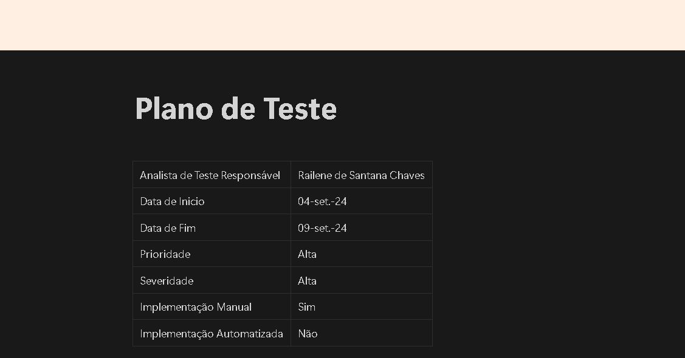
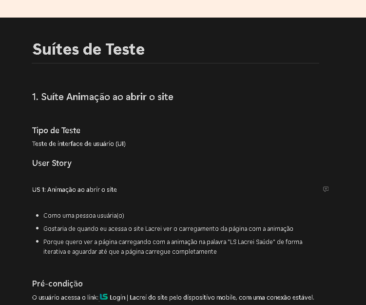
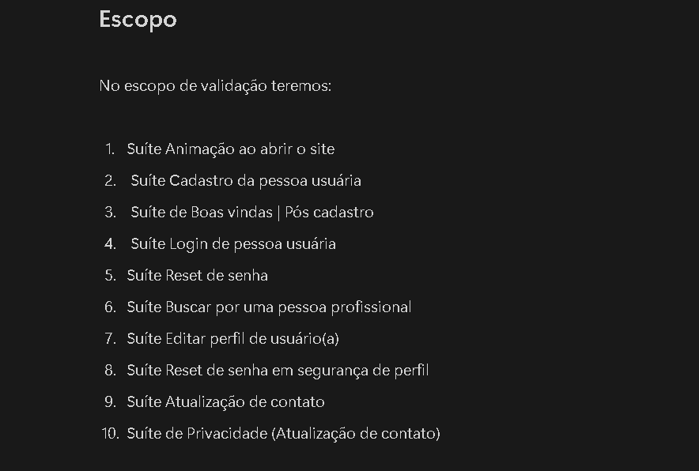
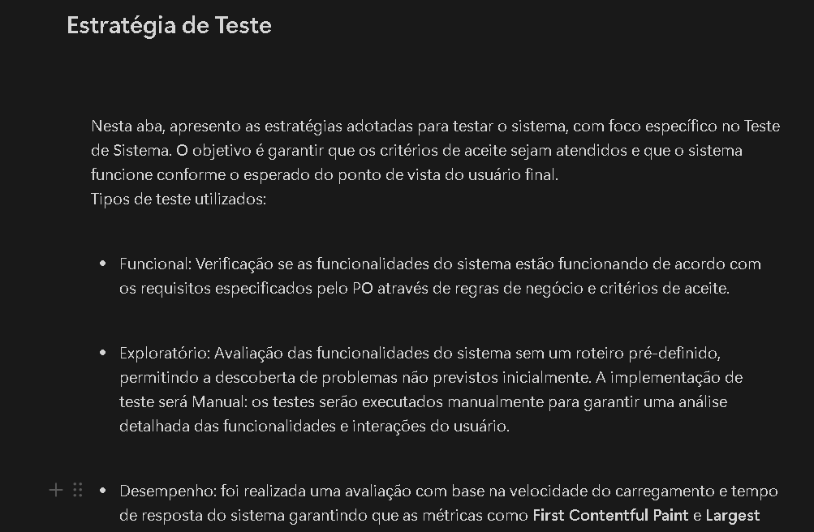
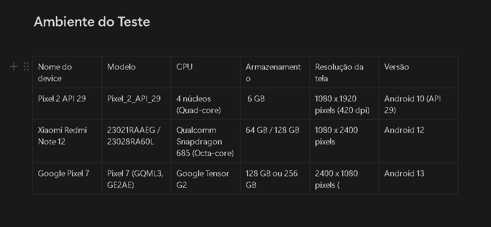

# Projeto Lacrei Saúde

Este projeto foi criado com o propósito de executar o **Plano de Teste** de um projeto. Onde foi levado em consideração analisar um site já existente, realizar levantamento  dos seus requisitos, criação de suítes e casos de teste para a execução.

## Ferramentas

- Site utilizado para elaboração do Plano [Lacrei Saúde](https://paciente-staging.lacreisaude.com.br/)

  

## Plano de Teste

### Apresentação do Plano
 
Na aba introdução do Notion, irá conter todas as informações base do projeto.

## Apresentando a Suíte

Na aba **suíte de animação ao abrir o site** irá conter todas as informações necessárias para a execução dos testes vinculados à suíte.

### Objetivo do Teste

O objetivo do teste da suíte de Animação é verificar se página carrega corretamente de acordo com a animação na palavra "LS Lacrei Saúde" de forma iterativa e aguardar até que a página carregue completamente

### Tempo de Execução

O tempo de execução dos testes da suíte de login teve a duração de **5 minutos**.

### Protótipo

A importância do protótipo das páginas é para auxiliar o time sobre como será a tela do sistema e seus fluxos de sucesso e validação de mensagens de erro.

### Pré-condição

A pré-condição na suíte de teste é utilizada para auxiliar em uma condição para o andamento do processo de teste.

### Dados Necessários

Os dados necessários são utilizados para auxiliar no processo de teste. Durante a execução, esses dados são indispensáveis para validar os testes corretamente.

### Critério de Aceite

Os **critérios de aceite** validam se a implementação de uma user story atende às expectativas do usuário. Eles garantem que o sistema funcione de acordo com o planejado.

### Requisitos

Os requisitos foram criados com base em **histórias de usuários** e são utilizados como uma forma de trazer o desejo do usuário para determinada funcionalidade. Eles servem como guia para garantir que o sistema entregue solucione os problemas ou demandas identificadas.

### Casos de Teste

Um **caso de teste** descreve as condições e passos detalhados para verificar se uma funcionalidade do sistema funciona conforme os requisitos. O objetivo é validar se o sistema está funcionando conforme o esperado.

**Nível de Detalhe**: 

Um caso de teste é mais detalhado do que um critério de aceite. Ele inclui:

- Passos específicos
- Dados de teste
- Pré-condições
- Resultados esperados e obtidos

### Prioridade

Se refere à **urgência** na qual um defeito ou funcionalidade deve ser resolvido ou implementado. Um item com alta prioridade deve ser tratado antes que os menos críticos.

### Severidade

A **severidade** está relacionada ao impacto que um defeito pode ter no sistema. Quanto maior a severidade, maior é o dano que o defeito pode causar ao sistema.

## Escopo

Na aba de **escopo de testes** apresento os principais requisitos funcionais do sistema, com foco em garantir que funcionalidades essenciais, como login, cadastro, busca por profissionais de saúde, estejam funcionando conforme esperado. Cada caso de uso foi mapeado para um tipo de teste funcional, sendo a execução planejada de forma manual.	

## Estratégia

Nesta aba, apresento as **estratégias de teste** adotadas para testar o sistema, com foco específico no Teste de Sistema. O objetivo é garantir que os critérios de aceite sejam atendidos e que o sistema funcione conforme o esperado do ponto de vista do usuário final.

## Ambiente de Teste

Nesta aba de **ambiente de teste** apresento tipo de ambiente que foi realizado a execução de teste, o tipo de dispositivo mostra o navegador
que foi testado, o modelo mostra a versão do navegador e em configurações de Hardware é exibido o tipo de dispositivo físico que foi ralizado o teste e a versão do sistema operacional do computador.	

## Ferramentas

Nesta seção, irei descrever as ferramentas que foram utilizadas para a construção e execução deste projeto.

### 1. **Miro**

- Utilizado para o mapeamento de fluxos e brainstorming colaborativo. O Miro foi utilizado para a Análise do Projeto.

### 2. **Notion**

- Utilizado como principal ferramenta de organização e documentação. Nele foram armazenadas o Plano de Teste.

### 3. **GitHub**

- Utilizado para o controle de versão e como apresentação deste portifólio contendo o desafio.

### 4. **ColorZilla**

- Ferramenta de análise de cores, utilizado para garantir a consistência das paletas de cores utilizadas no sistemma.

### 5. **Screenpresso**

- Ferramenta utilizada para gravação de evidências, as evidências incluídas são em formato de: vídeo e screenshot.

### 5. **Android Studio (Celular e Emulador)**

- Utilizado para testes de funcionalidade e responsividade em dispositivos Android, tanto físicos quanto emuladores, garantindo a responsividade e o comportamento adequado do app.

### 6. **Lighthouse**

- Ferramenta utilizada para análise de performance, acessibilidade e SEO do aplicativo, com o objetivo de otimizar o desempenho e garantir uma boa experiência para o usuário final.

## Resumo dos Resultados e Sugestão de Melhorias

Nesta seção, apresento os resultados com base nas métricas de teste, destacando que todos os requisitos foram cobertos. Foram executados **31 casos de teste**, com **29 aprovados**. Foi identificado **dois** defeitos com severidade **alta**:

### Defeitos Identificados

Nesta aba, irei descrever o Reporte de Bugs encontrados em alto nível e as sugestões de melhorias para o Sistema, para mais detalhes sobre os defeitos encontrados, vá até a seção de issues do **Github** do Link abaixo.

Clique aqui: [**Issues** do projeto](https://github.com/railenesantana/desafio-qa-lacrei/issues)

- **ID - 13:** A página de login do sistema Lacrei não é responsiva em dispositivos móveis. Quando acessada com campos vazios, os elementos de erro e os botões de “Entrar” e “Criar Conta” não estão corretamente posicionados e não apresentam a devida flexibilidade. Em um dos dispositivos testados, os botões estão muito próximos e a página não segue os padrões de responsividade esperados.

- **ID - 24:** O sistema falha ao salvar as alterações no perfil. Apesar de preencher todos os campos obrigatórios corretamente, o sistema exibe uma mensagem de erro e acusa o campo de data de nascimento como obrigatório, mesmo quando preenchido. Isso indica falhas na validação e no processo de salvamento.

### Sugestões de Melhorias

- **ID - 28:** O sistema deve exibir uma mensagem de confirmação quando o número de telefone do usuário for salvo com sucesso. Isso garantirá que o usuário saiba que os dados foram salvos corretamente, proporcionando uma melhor experiência e clareza.

- **ID - 25:** Após a alteração da senha, o sistema deve exibir uma mensagem de confirmação informando ao usuário que a senha foi alterada com sucesso. Isso garantirá que o usuário saiba que a alteração foi bem-sucedida.

- **ID - 31:** Quando a conta do usuário for apagada, o sistema deve exibir um feedback informativo ao usuário, em vez de redirecioná-lo diretamente para o login. A mensagem deve confirmar que a conta foi apagada e pode incluir um incentivo para o usuário voltar a usar o sistema no futuro, como uma oferta de assistência ou um convite para criar uma nova conta, se apropriado.

- **ID - 24:** O sistema deve exibir uma mensagem de confirmação após a alteração de dados no perfil. A mensagem deve informar ao usuário que os dados foram atualizados com sucesso, garantindo que o usuário esteja ciente de que as mudanças foram salvas corretamente.
